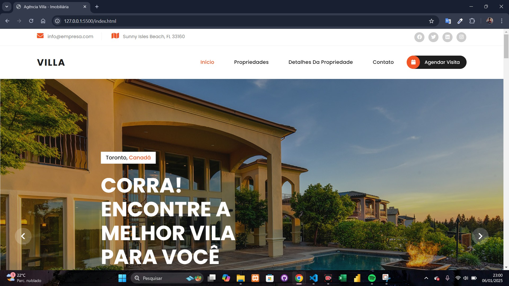
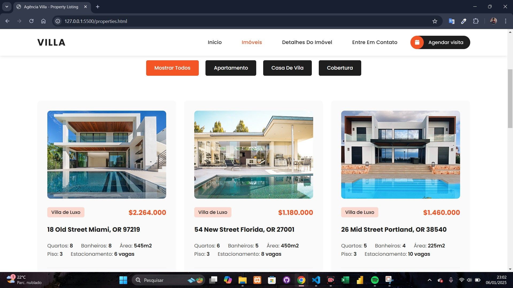
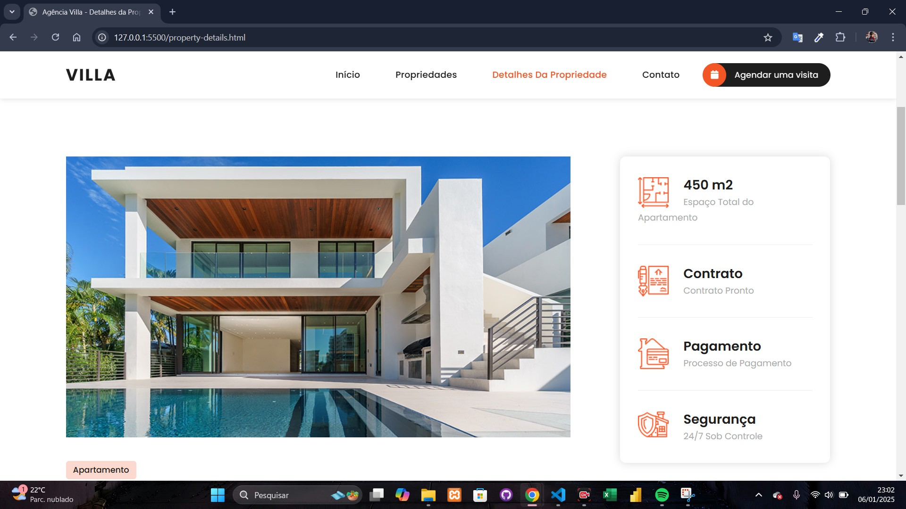
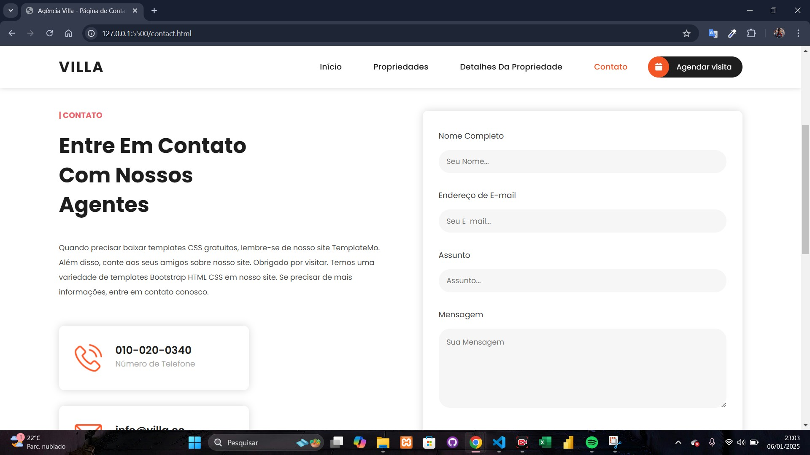

## 🌐 Agência Villa Imobiliária - Website

Este repositório contém o código-fonte de um site desenvolvido para a **Agência Villa Imobiliária**, uma plataforma virtual que visa fornecer uma experiência moderna e eficiente para os usuários. O site foi construído com **HTML**, **CSS**, **JavaScript**, e utiliza frameworks como **Bootstrap** e **jQuery** para garantir uma interface **responsiva**, **intuitiva** e **facilmente navegável**.

🌟 Funcionalidades
🏠 Página inicial com informações principais da agência.
📋 Página de listagem das propriedades disponíveis.
🔍 Página detalhada para cada propriedade.
✉️ Formulário de contato para visitantes.

##🚀 Como Executar o Projeto

GIT clone https://github.com/yLeonardo99/agencia-virtual.git

## 🛠️ Tecnologias Utilizadas  

- **HTML5**
- **CSS3**
- **JavaScript**
- **Bootstrap**  
- **jQuery**

## 📸 Imagens do Projeto  

  

  

  

  

## 🎥 Demonstração do Projeto  

Confira o vídeo abaixo para ver o site em funcionamento:  

[![Demonstração do Projeto];

https://github.com/user-attachments/assets/b0b3c687-daf2-4b0f-b04b-198deb41ed41

## 🎶 Música Utilizada

**Música**: Let Go  
**Autor**: Beau Young Prince  

## 📝 Licença
Este projeto está licenciado sob a Licença MIT. Sinta-se à vontade para usá-lo e modificá-lo conforme necessário.

